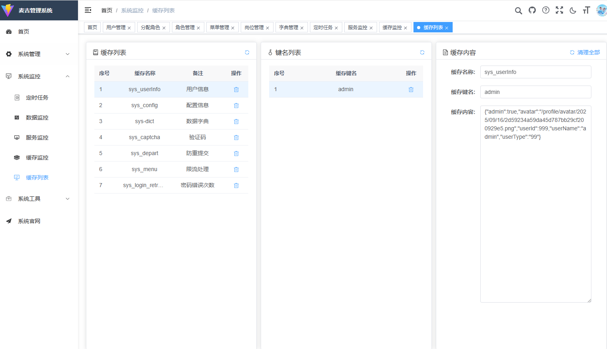
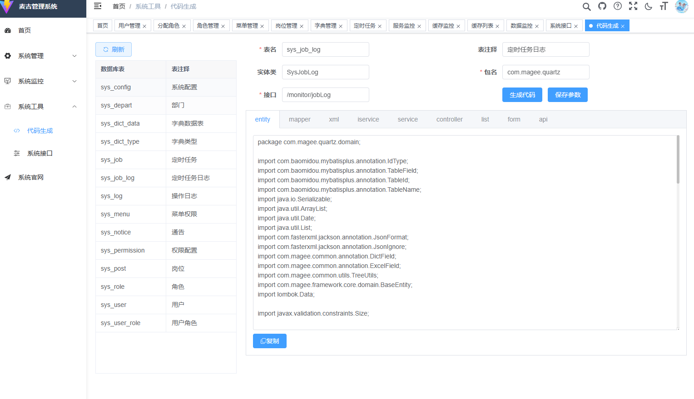

<h1 align="center" style="margin: 30px 0 30px; font-weight: bold;">magee-framework</h1>
<h4 align="center">基于SpringBoot+Vue3前后端分离的Java快速开发框架</h4>

## 开发框架简介
magee-framework是一套自带权限管理的快速开发框架,用于企业管理系统快速开发

* 前端采用Vue3、Element-Plus
* 后端采用Spring Boot、shiro、Redis & Jwt、mybatisPlus
* shiro权限控制,可以手动注释@Anonymous忽略权限控制
* 支持动态权限菜单，多种权限控制（用户+ 角色 + 数据访问权限 ）
* 支持复杂sql动态查询,支持单表查询、多表连接查询，支持多字段排序,避免手写if语句, 三行代码实现复杂查询
``` 
QueryWrapper<SysUser> queryWrapper = SimpleQuery.toQueryWrapper(userParam);
IPage<SysUser> page = SimpleQuery.toPage();
page = userService.page(page, queryWrapper);
```
* 数据字典字段自动映射,减少前后端大量条件判断
```
字典字段添加注解
/**
 * 状态 0 停用 1 启用
 */
@DictField(dictType = "sys_normal_disable")
private Integer status;

前端使用: 字段名+ _dictText
<el-table-column label="状态" align="center" prop="status_dictText">
```
* 高效率开发，使用代码生成器一键生成前后端代码
* excel自动导入导出
```
// 添加字段注释
@Size(min= 0, max = 1000, message="参数长度在0-1,000之间")
@ExcelField(name="参数",  width = 15)
private String param;

// 调用工具类导入导出
```
* 敏感字段过滤，支持密码、银行卡、身份证、用户名等多种方式
``` 
@SensitiveField(type = SensitiveType.USERNAME)
private String userName; 
```

## 内置功能
1. 用户管理：用户是系统操作者，该功能主要完成系统用户配置、用户权限配置
2. 部门管理：配置系统组织机构（公司、部门、小组），树结构展现支持数据权限
3. 岗位管理：配置系统用户所属担任职务
4. 菜单管理：配置系统菜单，操作权限，按钮权限标识等
5. 角色管理：角色菜单权限分配、设置角色按机构进行数据范围权限划分
6. 字典管理：对系统中经常使用的一些较为固定的数据进行维护
7. 参数管理：对系统动态配置常用参数 
8. 通知公告：系统通知公告信息发布维护
9. 操作日志：系统正常操作日志记录和查询；系统异常信息日志记录和查询
10. 定时任务：在线（添加、修改、删除)任务调度包含执行结果日志
11. 代码生成：前后端代码的生成 
12. 系统接口：根据业务代码自动生成相关的api接口文档
13. 服务监控：监视当前系统CPU、内存、磁盘、堆栈等相关信息
14. 缓存监控：对系统的缓存信息查询，命令统计等
15. 连接池监视：监视当前系统数据库连接池状态，可进行分析SQL找出系统性能瓶颈

## 在线体验
admin/123456

演示图片:


<table> 
  <tr>
    <td></td> 
  </tr>
  <tr>
    <td></td> 
  </tr>
  <tr>
    <td></td> 
  </tr>
  <tr>
    <td></td> 
  </tr>
  <tr>
    <td></td> 
  </tr>
  <tr>
    <td></td> 
  </tr>
  <tr>
    <td></td> 
  </tr>
  <tr>
    <td></td> 
  </tr>
  <tr>
    <td></td> 
  </tr>
  <tr>
    <td></td> 
  </tr>
  <tr>
    <td></td> 
  </tr>
  <tr>
    <td></td> 
  </tr>
</table>
文档地址:  

## 演示图

## magee-framework快速开发开交流群 
<a href="https://qm.qq.com/q/cuOrHoA6ME" target="_blank" style="display:inline-block;padding:8px 16px;background:#07C160;color:#fff;border-radius:4px;text-decoration:none;">🚀 加入QQ交流群</a>